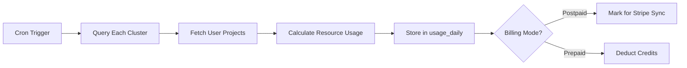

# Billing Architecture Documentation

## Overview

The Hopsworks Managed platform implements a hybrid billing system that supports both pay-as-you-go (postpaid) and prepaid credits. By default, all users start with pay-as-you-go billing, with prepaid credits available behind a feature flag for negotiated enterprise customers.

## Billing Modes

### 1. Pay-as-you-go (Default)
- Users are billed monthly for actual usage
- Usage is reported daily to Stripe
- Stripe handles invoicing and payment collection
- No upfront payment required

### 2. Prepaid Credits (Feature Flag)
- Available only after negotiation
- Users purchase credits upfront
- Credits are deducted in real-time as resources are consumed
- Optional auto-refill when balance drops below threshold

## Database Schema

### Core Tables

#### `users`
```sql
billing_mode: 'prepaid' | 'postpaid' (default: 'postpaid')
auto_refill_enabled: boolean
auto_refill_amount: decimal
auto_refill_threshold: decimal
stripe_customer_id: text
stripe_subscription_id: text
```

#### `user_credits`
- Tracks credit balance for prepaid users
- Maintains separate tracking for free trial credits vs purchased credits
- Generated column `balance` = `total_purchased - total_used`

#### `usage_daily`
- Records daily resource consumption
- Links to `hopsworks_cluster_id` for cluster-based billing
- Tracks whether usage was reported to Stripe (postpaid) or deducted from credits (prepaid)

#### `credit_transactions`
- Audit trail for all credit movements
- Types: purchase, usage, refund, grant, adjustment

## User-Cluster Relationship

### Cluster Assignment Model

```
users (1) -----> (1) user_hopsworks_assignments (n) -----> (1) hopsworks_clusters
```

- Each user is assigned to exactly one Hopsworks cluster
- Clusters have capacity limits (`max_users`)
- New users are auto-assigned to clusters with available capacity
- Assignment happens during first login via Auth0 webhook

### Cluster Table Structure

```sql
hopsworks_clusters:
  - id: UUID
  - name: unique cluster identifier (e.g., 'demo.hops.works')
  - api_url: cluster endpoint
  - max_users: capacity limit
  - current_users: active assignments
  - status: active | maintenance | full | inactive
```

## Usage Collection Flow

### 1. Daily Usage Collection (Cron Job)



### 2. Usage Calculation

For each user on each cluster:
- **CPU Hours**: Instance type × hours running × instance count
- **Storage**: Peak GB used during the day
- **API Calls**: Sum of all API requests

### 3. Cost Calculation

```typescript
// Instance-based pricing
const cpuCost = instanceHourlyRates[instanceType] * hours;

// Storage tiered pricing
const storageCost = calculateTieredPrice(storageGB);

// API pricing
const apiCost = (apiCalls / 1000) * apiCallPricing.general;

const totalDailyCost = cpuCost + storageCost + apiCost;
```

## Stripe Integration

### Products Structure

#### For Postpaid Users
- **Subscription Product**: Monthly subscription with $0 base
- **Metered Prices**:
  - CPU Hours: Reported daily, aggregated monthly
  - Storage GB: Last value during period
  - API Calls: Sum aggregation

#### For Prepaid Users
- **One-time Products**: Credit packages ($25, $50, $100, $500)
- **No subscription required**

### Webhook Handling

```typescript
// Key webhooks
'checkout.session.completed': // Credit purchase
'invoice.payment_succeeded': // Postpaid billing
'invoice.payment_failed': // Payment failure
'customer.subscription.deleted': // Account suspension
```

## API Endpoints

### Usage Reporting
- `GET /api/usage` - Current month usage summary
- `GET /api/usage/daily` - Daily breakdown
- `GET /api/usage/history` - Historical usage

### Billing Management
- `POST /api/billing/sync-stripe` - Sync usage to Stripe (cron)
- `POST /api/billing/purchase-credits` - Buy credits (prepaid)
- `GET /api/billing/balance` - Check credit balance

### Cluster Information
- `GET /api/instance` - Get assigned cluster details
- `GET /api/clusters/capacity` - Check cluster availability

## Feature Flags

### Enabling Prepaid Mode

```typescript
// Check in user metadata or separate feature flags table
const isPrepaidEnabled = user.metadata?.features?.prepaid_enabled || false;

// Admin can enable via:
UPDATE users 
SET 
  billing_mode = 'prepaid',
  metadata = jsonb_set(metadata, '{features,prepaid_enabled}', 'true')
WHERE email = 'enterprise@customer.com';
```

## Monitoring Queries

### Daily Revenue Report
```sql
-- Postpaid usage value
SELECT 
  date,
  SUM(total_cost) as revenue,
  COUNT(DISTINCT user_id) as active_users
FROM usage_daily
WHERE date >= CURRENT_DATE - INTERVAL '30 days'
GROUP BY date
ORDER BY date DESC;
```

### Credit Balance Check
```sql
-- Users with low credit balance
SELECT 
  u.email,
  uc.balance,
  uc.total_purchased,
  uc.total_used
FROM users u
JOIN user_credits uc ON u.id = uc.user_id
WHERE u.billing_mode = 'prepaid'
  AND uc.balance < 10
  AND u.status = 'active';
```

### Cluster Utilization
```sql
-- Cluster capacity and usage
SELECT 
  hc.name,
  hc.current_users,
  hc.max_users,
  ROUND(hc.current_users::numeric / hc.max_users * 100, 2) as utilization_pct,
  SUM(ud.total_cost) as daily_revenue
FROM hopsworks_clusters hc
LEFT JOIN usage_daily ud ON hc.id = ud.hopsworks_cluster_id 
  AND ud.date = CURRENT_DATE - 1
WHERE hc.status = 'active'
GROUP BY hc.id, hc.name, hc.current_users, hc.max_users;
```

## Security Considerations

1. **Row Level Security**: Users can only see their own data
2. **API Authentication**: All billing endpoints require authenticated session
3. **Webhook Validation**: Stripe signatures verified on all webhooks
4. **Credit Deduction**: Atomic operations with row locks to prevent race conditions
5. **Audit Trail**: All credit movements logged in credit_transactions

## Implementation Checklist

- [ ] Database migrations applied
- [ ] Stripe products configured
- [ ] Webhook endpoints secured
- [ ] Usage collection cron job scheduled
- [ ] Feature flag system implemented
- [ ] Monitoring dashboards created
- [ ] Alert thresholds configured